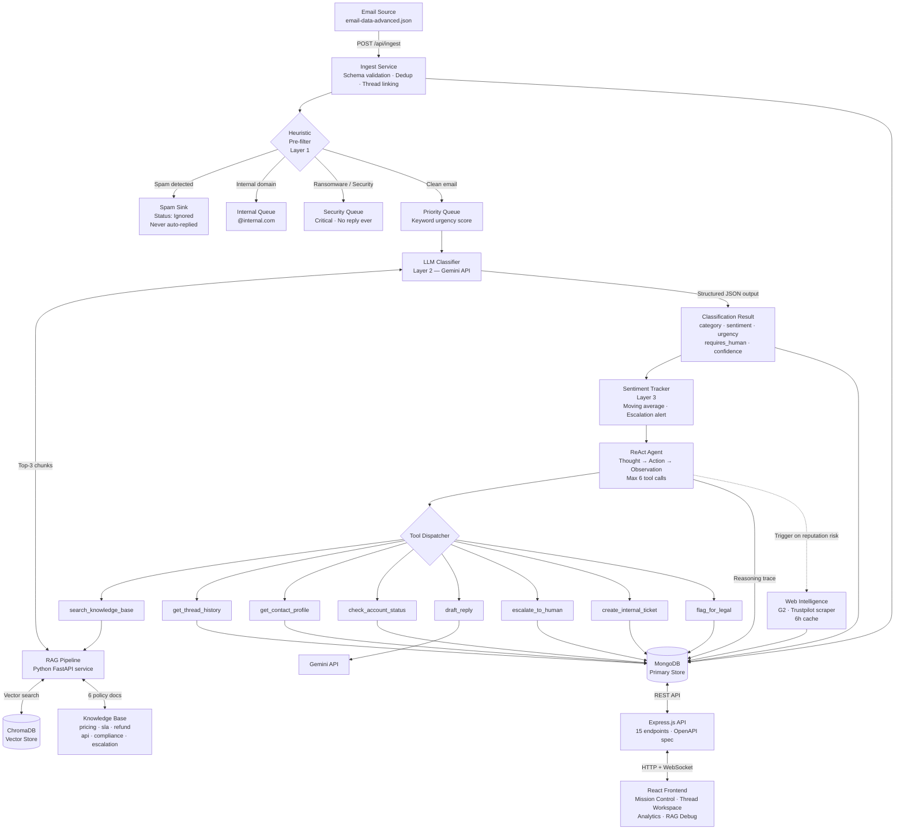
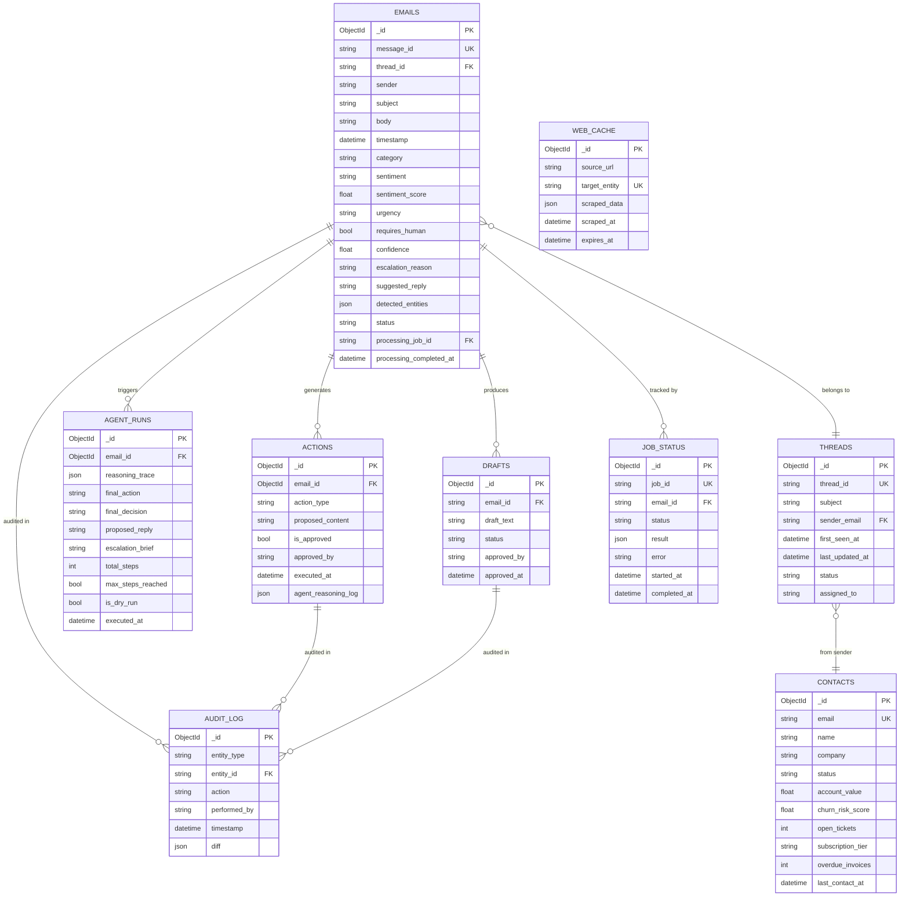

# System Architecture

## Full System Flow

## Component Breakdown

| Layer | Technology | Purpose |
|-------|-----------|---------|
| Ingest | Node.js / Express | Schema validation, dedup via `message_id`, thread linking, priority scoring |
| Heuristic Filter | Custom JS (sync, <10ms) | Spam blocklist, urgency keywords, security flagging, internal routing |
| LLM Classifier | Gemini API | Multi-dimensional classification with structured JSON output |
| RAG Pipeline | Python FastAPI + ChromaDB | Semantic retrieval of policy chunks; injects top-3 into LLM context |
| Embeddings | `sentence-transformers` (all-MiniLM-L6-v2) | Local embeddings, no external API cost |
| Agent | ReAct loop (Node.js) | Multi-step reasoning with 10 tools, max 6 calls, dry-run mode |
| Database | MongoDB (Mongoose) | All persistent state: emails, threads, contacts, agent runs, audit logs |
| Web Intelligence | Puppeteer + node-cache | Async public sentiment scraping with 6h TTL cache |
| API | Express.js + Swagger UI | 15 REST endpoints with consistent error envelopes |
| Frontend | React (CRA) + Recharts | 4-page SPA: inbox, analytics, contacts, RAG debug |
| Real-time | Socket.io | WebSocket push for live email events and stream progress |

---

## ER Diagram (MongoDB Collections)

---

## Architectural Decisions & Trade-offs

### Why MongoDB over PostgreSQL?
The email data is document-oriented with variable JSON fields (`detected_entities`, `agent_reasoning_log`). MongoDB's flexible schema avoids complex migrations as the AI output schema evolves. The trade-off is no native vector search — solved by delegating vector operations to ChromaDB via the Python ai-service.

### Why a separate Python service for RAG?
The best embedding models (`sentence-transformers`) and vector DBs (ChromaDB) have mature Python SDKs. Running a FastAPI sidecar keeps the Node.js core clean while giving access to the Python ML ecosystem. Communication is HTTP-local, adding <5ms latency.

### Why Gemini over GPT-4?
Gemini 1.5 Pro offers a 1M token context window — ideal for injecting full thread history + RAG chunks into a single prompt without truncation. Gemini Flash is used for high-volume classification (faster, cheaper) while Pro is reserved for complex agent reasoning.

### Why ReAct pattern over simple chain?
ReAct (Reason + Act) produces an explicit Thought → Action → Observation trace per step. This satisfies the spec requirement for a logged reasoning trace, enables dry-run mode naturally, and makes agent decisions auditable and debuggable in the UI.

### Conflicting Signal Resolution Strategy
When an email contains mixed signals (e.g., "I love the product but want a refund"), the classifier resolves by **priority ordering**: Legal > Security > Complaint > Billing > Inquiry. The highest-priority signal determines `category` and `urgency`. The mixed nature is captured in `sentiment: "Mixed"` and a lower `confidence` score. Confidence below 0.70 automatically sets `requires_human: true`.

### Known Limitations
- Web scraper returns simulated data in test mode (real Trustpilot scraping would require headless browser + proxy rotation to avoid rate limits)
- ChromaDB runs in-process; for production, would use a persistent Chroma server or migrate to Pinecone
- No message queue (Bull/RabbitMQ) — agent runs are synchronous; at scale would be async workers
- Agent plan is deterministic (rule-based routing) rather than LLM-driven tool selection; the trade-off is reliability and predictability over flexibility
